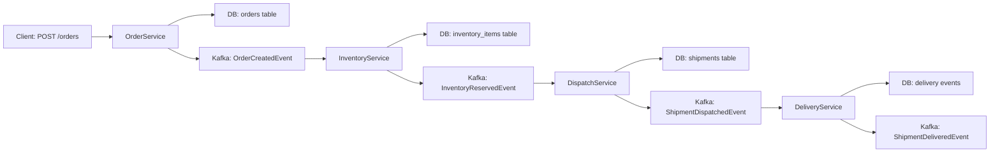
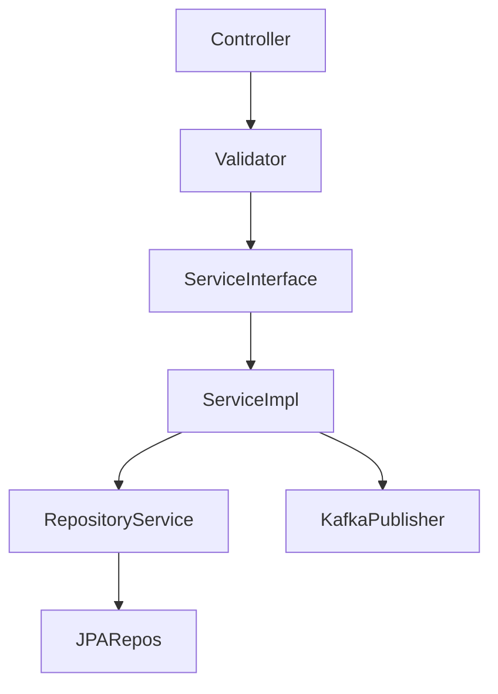
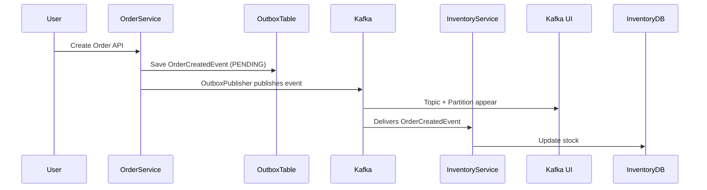

```markdown
# TransitFlow: Event-Driven Logistics Platform

TransitFlow is a modular, event-driven logistics platform designed for scalable, resilient, and decoupled order-to-delivery workflows. Each module is responsible for a specific domain and communicates via Kafka events, ensuring loose coupling and high reliability.

---

## 🧩 Modules

1. **transitflow-common**: Shared DTOs, events, and enums.
2. **transitflow-order**: Handles order creation and emits events.
3. **transitflow-inventory**: Tracks and reserves inventory.
4. **transitflow-dispatch**: Handles shipment and vehicle dispatching.
5. **transitflow-delivery**: Handles delivery and tracking.
6. **transitflow-kafka-config**: Shared Kafka bean configuration (optional).

---

## 🚦 Integration Flow



- **ORDERED ➝ RESERVED ➝ DISPATCHED ➝ DELIVERED**
- Each state transition is event-driven (Kafka), not direct service calls.

---

## 🏗️ Module Structure Example (Order Module)

```
transitflow-order/
└── src/
    └── main/
        ├── java/com/transitflow/order/
        │   ├── adapter/in/web               ← REST Controllers
        │   ├── adapter/out/jpa              ← JPA Repositories & Entities
        │   ├── application/port/in          ← Service Interfaces
        │   ├── application/port/out         ← Repository Interfaces
        │   ├── application/service          ← ServiceImpl
        │   ├── domain                       ← Domain Models
        │   ├── mapper                       ← MapStruct
        │   ├── messaging/publisher          ← KafkaPublisher
        │   └── validator                    ← Request validators
        └── resources/
            └── application.yml
```

---

## 🧱 Layered Flow Inside Each Module



---

## 🔄 Event-Driven Chronological Order

1. **transitflow-common**: Shared DTOs/events/enums
2. **transitflow-order**: Creates order + emits event
3. **transitflow-inventory**: Reserves stock
4. **transitflow-dispatch**: Assigns shipment
5. **transitflow-delivery**: Tracks delivery
6. **transitflow-kafka-config**: Shared Kafka config (optional)

---

## 🗂️ Outbox Pattern (Order Module)



---

## 🚚 Event Flow

- **OrderService** → `OrderCreatedEvent` → **InventoryService** → `InventoryReservedEvent` → **DispatchService** → `ShipmentDispatchedEvent` → **DeliveryService** → `ShipmentDeliveredEvent`

---


## ✅ Delivery Module Components

- **ShipmentEvent Entity**: Tracks delivery events in DB
- **ShipmentEventRepository**: Data access for tracking events
- **Delivery Kafka Config**: Consumer config for `ShipmentDispatchedEvent`
- **DeliveryService**: Core business logic for delivery
- **DeliveryEventListener**: Kafka consumer for dispatch events
- **DeliveryEventFactory**: Creates `ShipmentDeliveredEvent`
- **ShipmentDeliveredEvent**: Event published when delivery completes
- **DeliveryController**: REST endpoints for tracking/manual ops
- **OutboxPublisher**: Handles `ShipmentDeliveredEvent` publishing

---


flowchart LR
  Order["Order Module"]
  Inventory["Inventory Module"]
  Dispatch["Dispatch Module"]
  Delivery["Delivery Module"]
  Kafka["Kafka (Event Bus)"]

  Order -- "Publishes OrderCreated Event" --> Kafka
  Kafka -- "OrderCreated Event" --> Inventory
  Inventory -- "Publishes InventoryReserved Event" --> Kafka
  Kafka -- "InventoryReserved Event" --> Dispatch
  Dispatch -- "Publishes DispatchRequested Event" --> Kafka
  Kafka -- "DispatchRequested Event" --> Delivery
  Delivery -- "Publishes DeliveryCompleted Event" --> Kafka
  Kafka -- "DeliveryCompleted Event" --> Order

## 🐳 Docker & Local Development

- Make scripts executable:
  ```sh
  chmod +x transitflow-order/wait-for-mysql.sh
  chmod +x transitflow-inventory/wait-for-mysql.sh
  chmod +x transitflow-dispatch/wait-for-mysql.sh
  chmod +x transitflow-delivery/wait-for-mysql.sh
  ```
- Build and run all services:
  ```sh
  mvn clean package -DskipTests && docker compose up -d --build
  ```

---

## 📦 Quick Start

1. Clone the repo:
   ```sh
   git clone https://github.com/Shubh00796/TransitFlow-Event-Driven-Logistics-Platform.git
   cd TransitFlow-Event-Driven-Logistics-Platform
   ```
2. Build and start services:
   ```sh
   mvn clean package -DskipTests
   docker compose up -d --build
   ```
3. Access API (example):
   ```sh
   curl -X POST http://localhost:8081/api/orders -H 'Content-Type: application/json' -d '{"productId":1,"quantity":2}'
   ```

---

## 📖 Further Reading

- [Event-Driven Architecture](https://martinfowler.com/articles/201701-event-driven.html)
- [Kafka Documentation](https://kafka.apache.org/documentation/)
- [Outbox Pattern](https://microservices.io/patterns/data/transactional-outbox.html)

---

## 🤝 Contributing

Pull requests are welcome! For major changes, please open an issue first to discuss what you would like to change.

---

## 📄 License

[MIT](LICENSE)
```
