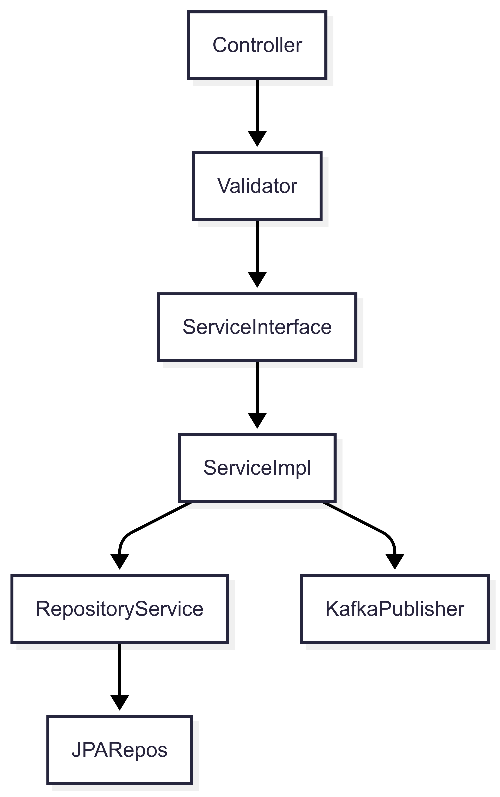
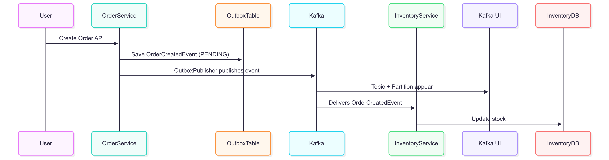

# 🚛 TransitFlow: Event-Driven Logistics Platform

**TransitFlow** is a modular, event-driven logistics platform designed for **scalable**, **resilient**, and **decoupled** order-to-delivery workflows. Each service owns its domain and communicates asynchronously using **Kafka**, enabling robust and fault-tolerant operations across the supply chain.

---

## 🧩 Core Modules

| Module                    | Responsibility                                   |
|---------------------------|--------------------------------------------------|
| `transitflow-common`      | Shared DTOs, events, and enums                   |
| `transitflow-order`       | Handles order creation and emits events          |
| `transitflow-inventory`   | Tracks and reserves inventory                    |
| `transitflow-dispatch`    | Manages shipment scheduling and dispatch         |
| `transitflow-delivery`    | Tracks and manages delivery lifecycle            |
| `transitflow-kafka-config`| Shared Kafka configuration (optional module)     |

---

## 🧱 Internal Architecture & Design Patterns

### 🧭 Layered Flow Inside Each Module



> All modules follow a **layered hexagonal architecture** for separation of concerns, testability, and clean dependency flow.

---

### 🗂️ Outbox Pattern (Order Module)



> The **Outbox pattern** ensures events are reliably published by storing them in a DB outbox and processing them via a background publisher.


### 🚚 Event Flow

```plaintext
OrderService → OrderCreatedEvent → InventoryService → InventoryReservedEvent → DispatchService → ShipmentDispatchedEvent → DeliveryService → ShipmentDeliveredEvent
